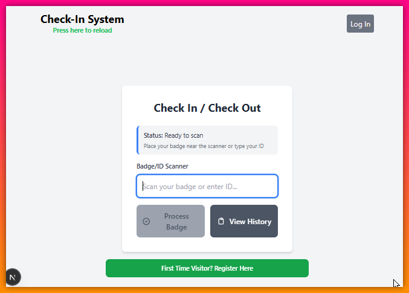
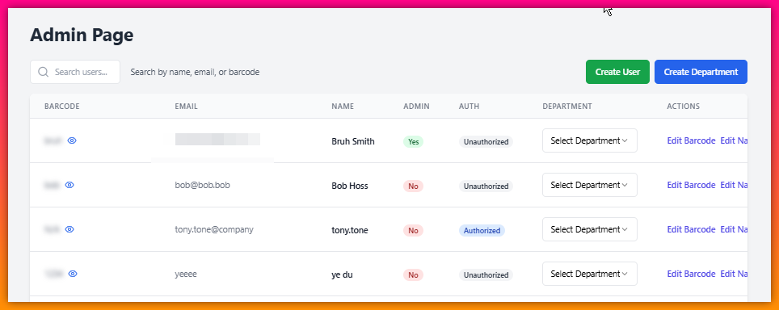
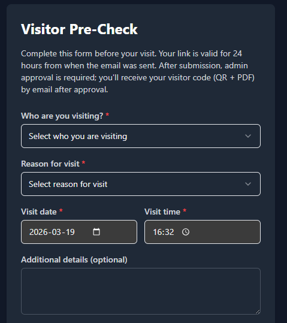
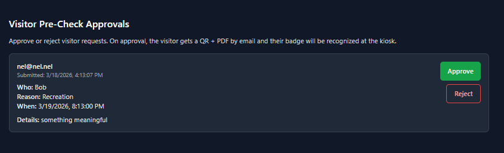
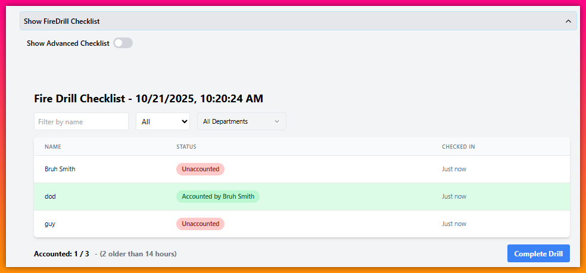
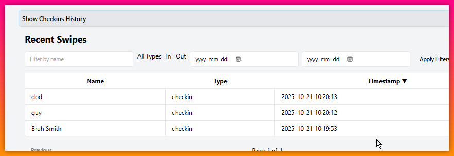

# 🕰️ Checker

## Real-time Check-In/Check-Out System for Small Businesses 🏢

Checker is a modern, efficient solution for managing employee attendance and time tracking. Built with cutting-edge technologies, it offers real-time updates and seamless scalability for growing businesses.

### ✨ Key Features

- 🔄 Real-time updates - no need to refresh!
- 🚀 Easily scalable for businesses of all sizes
- 🔐 Secure user authentication
- 🏢 Department management and user-department linking
- ⏰ Automatic check-out after configurable periods
- 🤖 System-generated check-ins for data population
- 🎨 Customizable through environment variables

### 🛠️ Technologies Used

- Next.js
- React
- InstantDB
- Deployment platform of choice: (Render/Vercel/Netlify/Heroku) etc.

### 📸 Screenshots

#### Main Interface



_The main check-in/check-out interface showing real-time employee status_

#### Admin Dashboard



_Administrative dashboard for managing users, departments, and system settings_

#### Visitor Pre-Check (Email → Form → Admin Approval)

_Visitors submit a tokenized pre-check request before arriving. Admin approves or rejects, and visitors receive QR + PDF for kiosk check-in._





#### Fire Drill Checklist

  
_Emergency fire drill checklist feature for safety compliance_

#### Recent Check-ins

  
_View of recent employee check-ins and check-outs with timestamps_

### 🧾 Visitor Pre-Check Flow
1. **Admin sends an email invite** to a visitor (tokenized link valid for 24 hours).
2. **Visitor opens the link** and fills out: _who/whom_, _reason_, and _when_ (with optional details).
3. **Request is queued** until an admin approves it.
4. **Admin approves or rejects**:
   - Approve: admin generates a visitor code and the visitor receives **QR + PDF** by email.
   - Reject: visitor receives a **rejection email** (default message, with optional admin-provided message).
5. **Kiosk check-in**: scanning the visitor code/QR completes check-in using the standard process.

### 🧰 Admin Panel → Visitors Management
The admin panel lives at `/admin-page` (tab: **Visitors**) and provides end-to-end management for visitor pre-check.

- **Send pre-check invites**: email a tokenized link (valid for 24 hours) to any address, with an optional display name.
- **Reusable protocol attachment**:
  - Upload a single “visitor protocol” document (PDF/PNG/JPG, max 5MB).
  - Optionally attach it to invite/pending emails and require the visitor to acknowledge receipt during pre-check.
- **Manage pre-check form dropdowns**: maintain the dynamic options used on the pre-check form:
  - **Who (host / whom)**: includes an optional **host notify email** per option (used to email the host a review link).
  - **Why (reason)** and **Company**: enable/disable entries and control their sort order.
- **Internal approval notifications**: configure a recipient list that gets an email summary when a visit is **approved**.
- **Approve / reject requests**:
  - Admin can approve or reject with an optional message included in the email.
  - Pending requests older than 24 hours after submission are highlighted as overdue.
  - Overdue pending requests can be removed; optionally send a fresh invite during cleanup.
- **Approved visitor list + cleanup**:
  - View approved (pre-checked) visitors, including barcode and approval timestamp.
  - Remove an approved row to delete the pre-check record and the linked kiosk user/visitor so the barcode no longer works.

### 🚀 Getting Started

1. Clone the repository:

```
git clone https://github.com/ashlessscythe/checker.git
```

2. Install dependencies:

```
cd checker
npm install
```

3. Set up your environment variables:

- Rename `.env.example` to `.env.local`
- Update the variables as needed:
  ```
  NEXT_PUBLIC_INSTANT_APP_ID=your_instant_app_id
  INSTANT_ADMIN_TOKEN=your_instant_admin_token
  NEXT_PUBLIC_THRESHOLD_HOURS=14
  NEXT_PUBLIC_ENABLE_AUTO_CLEANUP=false
  NEXT_PUBLIC_STALE_CHECKIN_CLEANUP_HOURS=18
  NEXT_PUBLIC_CLEANUP_INTERVAL_MINUTES=20
  ```

  Visitor pre-check (email token) settings:
  ```
  PRECHECK_TOKEN_SECRET="somethingsupersecret"
  NEXT_PUBLIC_APP_BASE_URL="http://127.0.0.1:3000"
  ```

  Email delivery (Resend) settings (used for visitor pre-check emails and admin test email):
  ```
  RESEND_API_KEY="keygoeshere"
  RESEND_FROM_EMAIL="Checker <noreply@example.com>"
  ```

  Visitor pre-check display timezone:
  ```
  NEXT_PUBLIC_VISITOR_DISPLAY_TIMEZONE="America/Denver"
  ```

4. Run the development server:

```
npm run dev
```

5. Open [http://localhost:3000](http://localhost:3000) in your browser to see the app in action!

### 🌐 Deployment

Make sure to set your InstantDB URL in your deployment environment settings.

### 🤝 Contributing

We welcome contributions! If you'd like to contribute:

1. Fork the repository
2. Create your feature branch (`git checkout -b feature/AmazingFeature`)
3. Commit your changes (`git commit -m 'Add some AmazingFeature'`)
4. Push to the branch (`git push origin feature/AmazingFeature`)
5. Open a Pull Request

Please ensure your code adheres to the project's coding standards and includes appropriate tests.

### 📄 License

This project is licensed under the MIT License - see the [LICENSE.md](LICENSE.md) file for details.

---

Built with ❤️ by Some dude
